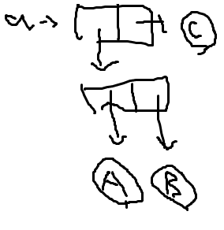
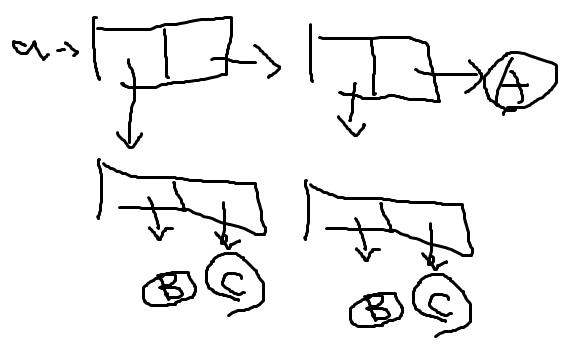
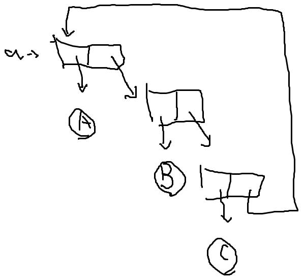
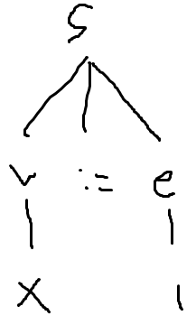
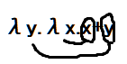
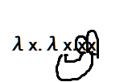
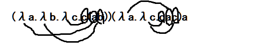

# 2020年度プログラム言語論 学期末レポート

- 201811528 春名航亨 (知識情報・図書館学類 3年次)

## 問1: True/False

- (a)
  - 誤
- (b)
  - 正
- (c)
  - 誤
- (d)
  - 正
- (e)
  - 正

## 問2: ポーランド記法／逆ポーランド記法

- (a)

```lisp
(* (+ 2 3) 4)
```
- (b)

```dc
2 3 + 4 *
```

## 問3: 用語確認（１）

- (a)
  - 命令
- (b)
  - 意味
- (c)
  - 副作用
- (d)
  - 高階関数
- (e)
  - ガベージコレクション
- (f)
  - 結合性
- (g)
  - 優先度
- (h)
  - ポインタ

## 問4: 用語確認（２）

- (a)
  - A
- (b)
  - C
    - Cはn=0でバグる
- (c)
  - 無し

## 問5: 用語確認（３）

- (a)
  - C
- (b)
  - I
- (c)
  - L
- (d)
  - M
- (e)
  - F
- (f)
  - D

## 問6: Lisp（１）

- (a)

```scheme
(= n 0)
```

- (b)

```scheme
(null? data)
```
- (c)

```scheme
(pair? v)
```

## 問7: Lisp（２）

- (a)

- (b)

- (c)


## 問8: 言語処理系の構成

- (a)
  - Syntax analyzer
- (b)
  - Code generator
- (c)
  - Code optimizer

## 問9: 文法

- (a)


- (b)
  - 無し
    - Aは+が邪魔
    - Bは末尾の;が邪魔
    - Cはaが邪魔

## 問10: 変数の束縛

- (a)

- (b)

- (c)


## 問11: ラムダ計算の基礎

- λz.(λy.y+x)(z+x)

## 問12: Prologの実行

- (a)
  - B
- (b)
  - A, B, C
- (c)
  - I
    - false
  - II
    - バックトラック

## 問13: オブジェクト指向言語に関する用語確認

- (a)
  - 動的ルックアップ
- (b)
  - 隠蔽
- (c)
  - サブタイピング
- (d)
  - 継承

## 問14: 様々なプログラミング言語

(a)～(c)について言語を一つずつ挙げ、
- 得意とする処理の説明（1文～数文）
- コードを交えた文法上の特徴の説明（数文～10文程度）

についてまとめる。

### (a): 関数型言語＜Haskell＞

以下は参考文献[1]の内容を参考にしたものである。

#### 得意とする処理

- パズル、ゲーム戦略の評価、解や最善手の探索といった記号処理
- コンパイラやインタプリタなどプログラミング言語の処理系実装

#### 文法上の特徴

- ラムダ式などのexpression based languageなのでラムダ計算が可能
- 以下のように、ラムダの代わりに`\`, `.`の代わりに`->`とかく

```haskell
-- λx.x
\ f x -> x;
-- 変数に代入
f0 = \ f x -> x;
```

- 変数は型推論により型が当てはめられるが、明示的にも書ける

```haskell
f1 :: Integer -> Integer;
f1 n = if n == 0 then 1 else n * fact(n - 1);
```

- 再帰やパターンマッチングに対応

```haskell
{-- Common Lisp
(defun myLength (list)
  (cond
    ((null list) 0)
    (t (+ 1 (myLength (cdr list)))))) --}
myLength :: [list] -> Integer;
myLength []     = 0;
myLength (x:xs) = 1 + myLength xs;
```

- 関数はまとめてモジュールに閉じ込められる

```haskell
module MyModule where {
  g1 = exp_1;
  g2 = exp_2;
  --    ... ;
  gn = exp_n;
}
```

### (b): Prologから派生した論理型言語＜Erlang＞

以下は参考文献[2]の内容を参考にしたものである。

#### 得意とする処理

- 分散型のスケーラブルかつハイパフォーマンスのアプリケーションを構築できる
  - 個々のコードを同マシンで並行実行できる
  - 並行実行中のプロセス内で発生したエラーを特定して処理できる(フォルト・トレラント性が高い)
  - あるマシンで実行されているプログラムを別のマシンから要求できる(分散実行が可能)

#### 文法上の特徴

- すべての式は(Prplogよろしく)`.`で終わる

```erlang
3+4.          %% 7
(4+5)*9.      %% 81
10.9E-2 +4.5. %% 4.609
hello.        %% hello
```

- 変数は最初の文字が大文字で、再代入不可

```erlang
Value = 99. %% 99
```

- 変更不可なタプルと柔軟なリストがある

```erlang
{abc, def, {0, 1}, ghi}.        %% {abc,def,{0,1},ghi}
[1,2,3,abc,def,ghi,[4,56,789]]. %% [1,2,3,abc,def,ghi,[4,56,789]]
```

- 関数はまとめてモジュールに閉じ込められる

```erlang
-module(fib).
-export([fib/1, printfib/1]). %% 関数一覧

printfib(N) ->                %% ホーン節
                              %% Prologの:=はErlangの->
   Res = fib:fib(N),
   io:fwrite("~w ~w~n", [N, Res]).

%% セミコロン;で複数の式(fact)を指定できる
%% whenでガードを書く
fib(0) -> 0 ;fib(1) -> 1;
fib(N) when N > 0 -> fib(N-1) + fib(N-2).
```

### (c): Kenneth E. Iversonによって開発された＜APL＞

#### 得意とする処理

以下は参考文献[3]の内容を参考にしたものである。

- 「APL記号」で記述することで短いコードを書ける
  - 可読性とトレードオフ
  - APLプログラマのキーボード

- 強力な配列操作機能で各要素に対して一度にいろいろな演算子を適用できる

#### 文法上の特徴

以下は参考文献[4], [5]の内容を参考にしたものである。

- 「APL記号」のセットを使うことで処理を短く書ける

- データは配列として表現

```apl
⍝
⍝ ここでは[4]のサイトでの実行結果を載せる
⍝
⍝ 計算
  2+2 ⋄ 3+3 ⋄ !4
⍝4
⍝6
⍝24
⍝ マイナスはアッパーバー
  0-10
⍝¯10
⍝ 配列と文字(1x1の配列)
  1 2 3 ⋄ 'hi!' ⋄ (1 2) (3 4) (5 6)
⍝1 2 3
⍝hi!
⍝┌───┬───┬───┐
⍝│1 2│3 4│5 6│
⍝└───┴───┴───┘
⍝ False, Trueは0, 1
  1>2 ⋄ 1=1 ⋄ 2>1
⍝0
⍝1
⍝1
⍝ 5x5の行列っぽい配列に1~25の連番を挿入
  5 5⍴⍳25
⍝ 1  2  3  4  5
⍝ 6  7  8  9 10
⍝11 12 13 14 15
⍝16 17 18 19 20
⍝21 22 23 24 25
⍝ 代入
  plus←+
  two←2
  three←3
  two plus three
⍝5
```

### 参考文献

[1]: 香川 考司, "関数型プログラミング言語 Haskellの理論と応用 第1章 関数型言語Haskellとは", 香川大学, 2007.
http://guppy.eng.kagawa-u.ac.jp/2007/HaskellKyoto/Text/Chapter1.pdf

[2]: Martin Brown, "Erlang プログラミング入門: 第 1 回 基本", IBM, 2011.
https://www.ibm.com/developerworks/jp/opensource/library/os-erlang1/index.html

[3]: まつもと ゆきひろ, "Rubyist のための他言語探訪 【第 12 回】 APL と J", Rubyist magazine, 2007.
https://magazine.rubyist.net/articles/0019/0019-Legwork.html

[4]: Joel Hough et al., "TryAPL".
https://tryapl.org/

[5]: Anonymous, "APL syntax and symbols", Wikipedia.
https://en.wikipedia.org/wiki/APL_syntax_and_symbols